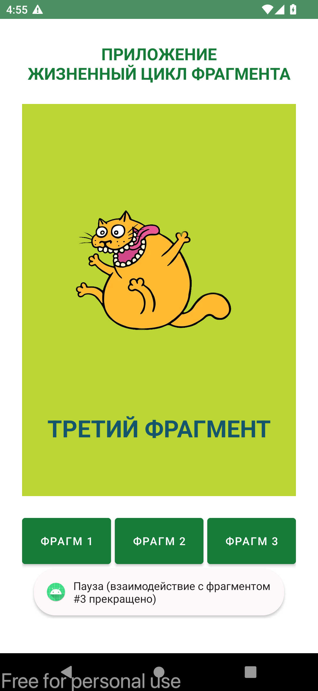

# Тема: Жизненный цикл фрагмента
- Приложение с одной активностью, содержащей несколько фрагментов
- В приложении реализована возможность переключать созданные фрагменты и просматривать последовательность запуска методов жизненных циклов фрагментов

## Задание
Необходимо к данному приложению добавить ещё один фрагмент и возможность вывода его на экран активности

